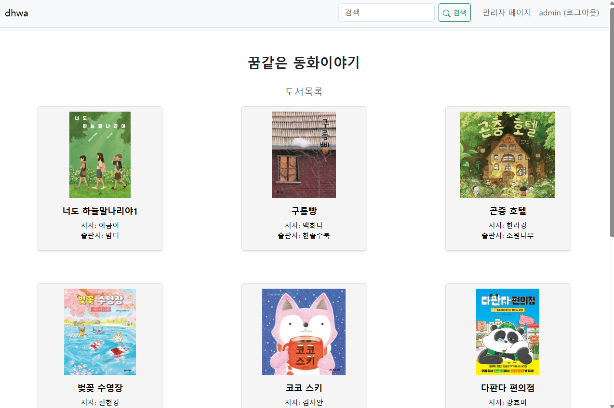
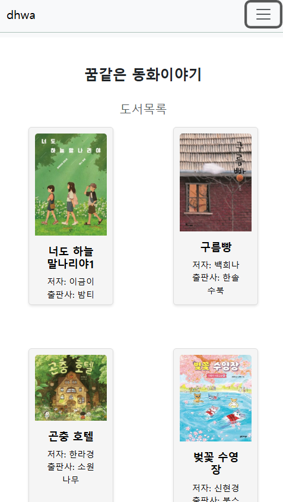
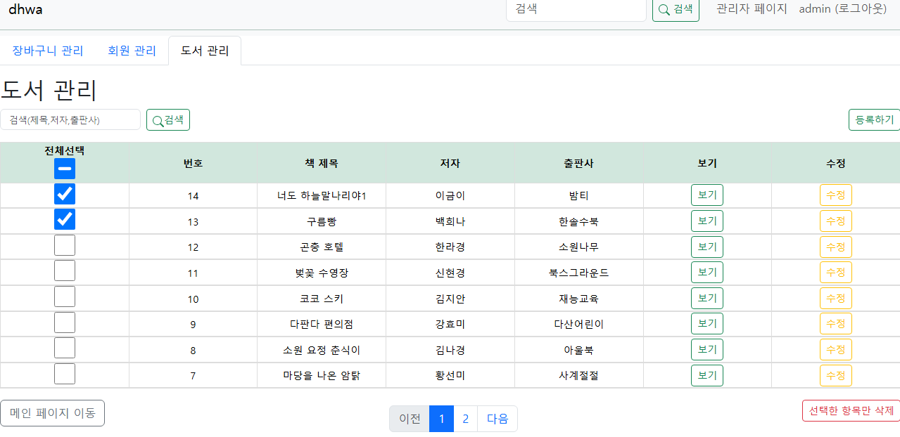

# 동화책 대여 서비스 (Dhwa Project)

동화에서 D를 본따 D-Hwa로 프로젝트명을 정하였습니다.  
아이들을 위한 동화책을 대여할 수 있는 Flask 기반 웹 프로젝트입니다.  
이미지 기반 도서 등록, 장바구니, 회원가입/로그인, 관리자 기능을 포함합니다.

---

## 주요 기능
- 도서 목록 및 검색
- 장바구니 기능
- 상품 상세 페이지, 관리자 도서 관리 페이지 (**My Role**)
- SQLite 기반 DB + Flask-Migrate로 데이터 관리

---

## Skill & Tools
- Python, Flask
- HTML, CSS, JavaScript
- VSCode, GitHub
- DB Browser for SQLite

---

## ER Diagram  


### ER Diagram 설명

본 프로젝트에서는 총 3개의 주요 테이블을 중심으로 동화책 대여 시스템을 구성하였습니다.

- **`dhwauser`** : 사용자 정보를 저장하는 테이블입니다.  
  - 회원가입 시 생성되며, 로그인 및 배송 정보 관리를 담당합니다.
  - 주요 컬럼: `username`, `password`, `email`, `address`, `postcode` 등

- **`dhwalist`** : 대여 가능한 동화책 목록을 관리합니다.  
  - 이미지와 함께 도서 정보를 등록하며, 관리자가 CRUD 작업을 수행합니다.
  - 주요 컬럼: `subject`, `writer`, `img`, `publi`

- **`dhwacart`** : 장바구니 및 대여 내역 테이블입니다.  
  - 사용자가 도서를 선택할 때 임시 저장되는 공간이며, 실제 대여 시 활용됩니다.
  - `list_id`(책), `username`(사용자)을 외래키로 연결해 도서와 회원 정보를 참조합니다.
  - 주요 컬럼: `amount`, `rent_date`, `return_date`

> ERD 구조는 회원 → 장바구니 → 도서 정보 간의 관계를 명확히 하여, 대여 흐름을 직관적으로 구성할 수 있도록 설계되었습니다.

---

## Usecase Diagram  


### Usecase Diagram 설명

본 프로젝트는 사용자 역할에 따라 다음과 같은 기능 흐름을 정의하였습니다.

### 비회원
- 도서 검색 및 목록 확인 가능
- 회원가입을 통해 더 많은 기능(장바구니, 대여 등) 이용 가능

### 회원
- 로그인 후 다음 기능 사용 가능:
  - 내 정보 조회 및 수정, 회원 탈퇴
  - 도서 검색, 장바구니 담기, 수량 변경, 장바구니 항목 삭제

### 관리자
- 전체 시스템을 관리하며 다음 기능 수행:
  - 회원 관리: 회원 등록/삭제, 검색
  - 도서 관리: 도서 등록/수정/삭제
  - 장바구니 관리: 장바구니 항목 검색/삭제

> Usecase Diagram은 사용자 입장에서의 기능 흐름을 시각화하여, 시스템이 어떤 요구를 충족하는지 명확하게 표현합니다.

---

## Screen View

### 메인페이지 (웹)


### 메인페이지 (모바일)


### 상품관리 페이지 (관리자 기능)


---
## My Role (담당 구현 파트)

- **도서 리스트 페이지 구현**
  - 사용자가 도서를 확인하고 대여할 수 있도록 도서 목록 출력 및 필터링 기능 구현
    
- **관리자 전용 도서 관리 페이지**
  - Flask 기반 CRUD 로직 구현
  - 아래 기능을 통해 도서 데이터 관리:
    -  도서 등록
    -  도서 수정
    -  도서 삭제
    -  도서 상세보기
    -  도서 검색
      
## 실행 방법

```bash
# 1. 가상환경 활성화
venv\Scripts\activate

# 2. 서버 실행
flask run
